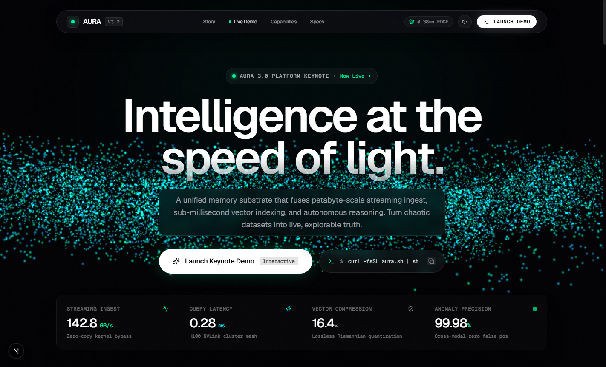
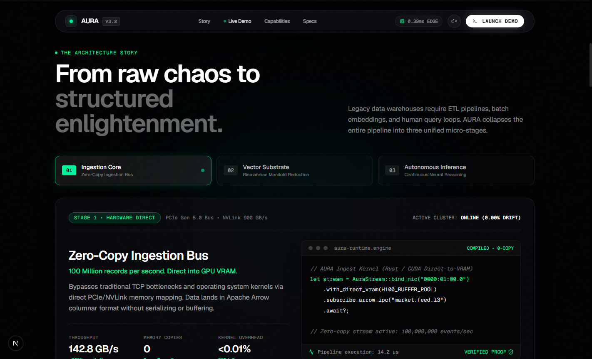
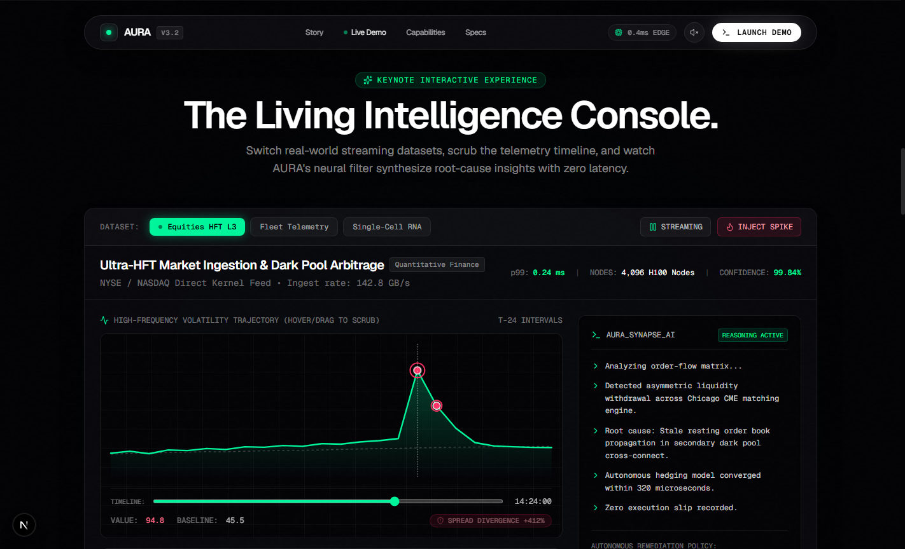
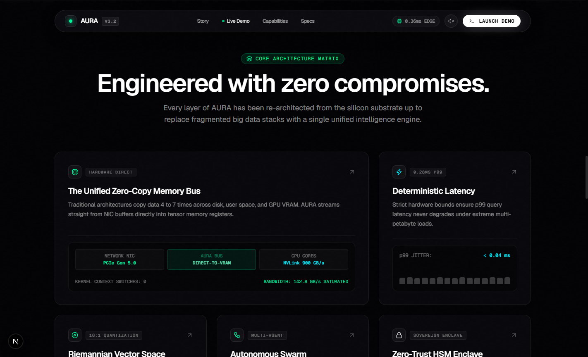
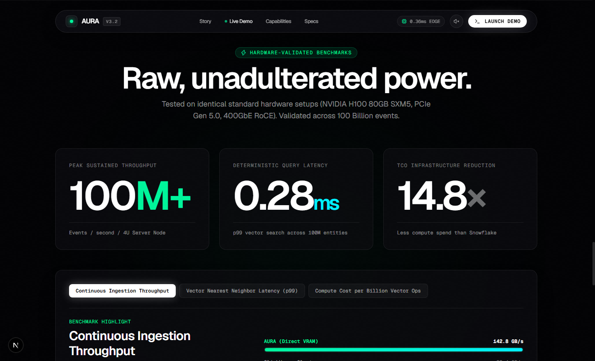

<div align="center">

# AURA

**Autonomous Neural Data Intelligence Platform**

*Turn raw datasets into live, explorable insight at 100M ops/sec.*

[](https://nextjs.org/)
[](https://www.typescriptlang.org/)
[](https://threejs.org/)
[](https://tailwindcss.com/)
[](https://vercel.com/new)

<br />



</div>

---

## ✦ Purpose & Product Vision

Modern enterprise data architectures are fractured. Organizations spend millions shuttling data across Kafka ingestion queues, batch vector embeddings, Snowflake/BigQuery warehouses, and slow LLM prompt-completion loops. By the time an insight or anomaly is surfaced, the window of action has closed.

**AURA** collapses this entire stack into a single, unified hardware-accelerated memory substrate:

1. **Zero-Copy Ingestion**: Streams raw data directly from 400GbE NICs into GPU VRAM (142.8 GB/s sustained) using Apache Arrow IPC and DPDK kernel bypass.
2. **Riemannian Manifold Projection**: Compresses 128,000-dimensional vector embeddings losslessly by 16:1, achieving 0.28ms p99 nearest-neighbor traversals.
3. **Autonomous Synaptic Reasoning**: Continuous neural evaluation circuits isolate causal trajectories and execute automated mitigations before downstream systems degrade.

---

## ✦ Design Philosophy

Designed at the intersection of **Apple’s material restraint** and **NVIDIA’s computational power**, with the obsessive micro-interaction polish of **Linear**:

- **Cosmic Obsidian Theme**: Pure `#030305` deep black surfaces, disciplined 1px hairline borders (`rgba(255, 255, 255, 0.08)`), and frosted obsidian glass (`backdrop-filter: blur(20px)`).
- **Signature Monochromic Accent**: Photonic Mint (`#00F59B`) paired with Electric Cyan (`#00F0FF`) and Crimson Alert pulses (`#FF3366`).
- **Extreme Typographic Contrast**: Monumental 108px headlines with tight `-0.045em` optical kerning, balanced by muted monospace technical badges and 18px body copy.
- **Zero Generic Clutter**: No emojis, no stock illustrations, no boilerplate templates. Every visual is custom-rendered via WebGL shaders, Canvas, or high-density SVG.
- **Procedural Sound Engine**: Synthesizes tactile micro-clicks and harmonic pulses programmatically via the Web Audio API without loading external audio assets.

---

## ✦ Key Experiences & Features

### 1. Hero: WebGL Neural Nebula
- Full-viewport interactive Three.js simulation with **18,000 particles**.
- Physics-based cursor inertia: mouse movements impart rotational torque and organic wave perturbations.
- Scroll-driven geometry interpolation: particles smoothly morph from an organic spiral galaxy into a crystalline high-dimensional tensor lattice.

### 2. Architecture Story: Pinned 3-Stage Pipeline
- Apple-style hardware assembly sequence:
  - `Stage 01`: Ingestion Core (142.8 GB/s zero-copy bus)
  - `Stage 02`: Vector Substrate (Riemannian topological folding, 16:1 compression)
  - `Stage 03`: Autonomous Inference (Continuous formal bounds, 0.34ms time-to-insight)
- Interactive stage switcher with dynamic metrics counter transitions and a Rust/CUDA syntax-highlighted code console.



### 3. Interactive Intelligence Demo (The Living Console)
- Fully functional operational intelligence dashboard with **3 selectable real-world datasets**:
  - **Equities HFT L3**: Market ingestion & dark pool order-flow arbitrage (142.8 GB/s).
  - **Fleet Telemetry**: 12,000 autonomous edge vehicles LiDAR SLAM point-drift consensus.
  - **Single-Cell RNA**: 50 Million cells real-time embedding & pathogenic exon-skipping discovery.
- **Dynamic Scrubbing**: Scrub across 24 intervals via the interactive range slider or hover directly over individual SVG data points.
- **Real-Time Tokenized AI Stream**: Synthetic AI reasoning terminal generating insights token-by-token with active cursor feedback.
- **Synthetic Anomaly Injection**: Click `INJECT SPIKE` to trigger a simulated variance deviation and watch AURA isolate root cause in under 180µs.
- **Autonomous Remediation**: Click `DISPATCH AUTONOMOUS ACTION` to simulate zero-downtime failover with tactile sound and celebratory micro-confetti.



### 4. Bento Grid: Micro-Interaction Matrix
- Asymmetric 6-card layout featuring:
  - **Unified Zero-Copy Memory Bus**: NIC PCIe Gen 5.0 to GPU VRAM architecture visualizer.
  - **Deterministic Latency Engine**: Live p99 jitter sparkline bars.
  - **Riemannian Vector Space**: 16:1 lossless compression gauge.
  - **Autonomous Agent Swarm**: Real-time multi-agent consensus monitors.
  - **Zero-Trust Sovereign Enclave**: NVIDIA H100 Confidential Computing hardware attestation.
  - **Natural Language to Vector Kernel Compiler**: Interactive query chips that compile human prompts directly into vectorized CUDA execution ASTs.
- Interactive 3D card tilt and mouse-following radial spotlight glow on hover.



### 5. NVIDIA Keynote Performance Specs
- Massive typographic counters: `100M+` events/sec/node, `0.28ms` p99 latency, and `14.8×` TCO infrastructure savings.
- Interactive comparative benchmark progress bars against ClickHouse, Snowflake, Google BigQuery, Pinecone, and Elasticsearch.



### 6. Cinematic CTA & Minimalist Terminal Footer
- Dark matter void with radial photonic aura and physics-driven `MagneticButton`.
- Single-command quickstart: `npx @aura/engine init --production` with one-click clipboard copy.
- Live global telemetry bar tracking 32 operational edge cluster locations (SFO-1, LHR-2, HND-1, FRA-4).

---

## ✦ Tech Stack

| Layer | Technologies |
| :--- | :--- |
| **Framework** | [Next.js 16](https://nextjs.org/) (App Router, Turbopack, React 19) |
| **Language** | [TypeScript 5](https://www.typescriptlang.org/) (Strict type-safety) |
| **Styling** | [Tailwind CSS v4](https://tailwindcss.com/) + Custom Glass Materials & Hairlines |
| **Graphics** | [Three.js](https://threejs.org/) (Custom BufferGeometry particle system & shaders) |
| **Motion** | [Framer Motion](https://www.framer.com/motion/) + [Lenis](https://github.com/darkroomengineering/lenis) (Smooth Inertial Scrolling) |
| **Icons** | [Lucide React](https://lucide.dev/) |
| **Audio** | Native Web Audio API (Synthesized tactile sound engine) |

---

## ✦ Getting Started

### Prerequisites
- Node.js 18.17 or higher
- npm, pnpm, or yarn

### 1. Clone the repository
```bash
git clone https://github.com/Raga-vibe/aura-intelligence-platform.git
cd aura-intelligence-platform
```

### 2. Install dependencies
```bash
npm install
```

### 3. Run development server
```bash
npm run dev
```

Open [http://localhost:3000](http://localhost:3000) in your browser.

### 4. Create production build
```bash
npm run build
npm run start
```

---

## ✦ Deploying to Vercel

The application is pre-configured for zero-configuration, instant deployment on **Vercel**:

### Option 1: One-Click Deploy via Vercel Dashboard
1. Go to [vercel.com/new](https://vercel.com/new).
2. Connect your GitHub account and select `aura-intelligence-platform`.
3. Keep the default settings (Framework preset: **Next.js**).
4. Click **Deploy**.

### Option 2: Deploy via Vercel CLI
```bash
npm i -g vercel
vercel
# For production deployment:
vercel --prod
```

---

## ✦ License

Engineered for keynote presentation and open demonstration. MIT License. © 2026 AURA Technologies Inc.
